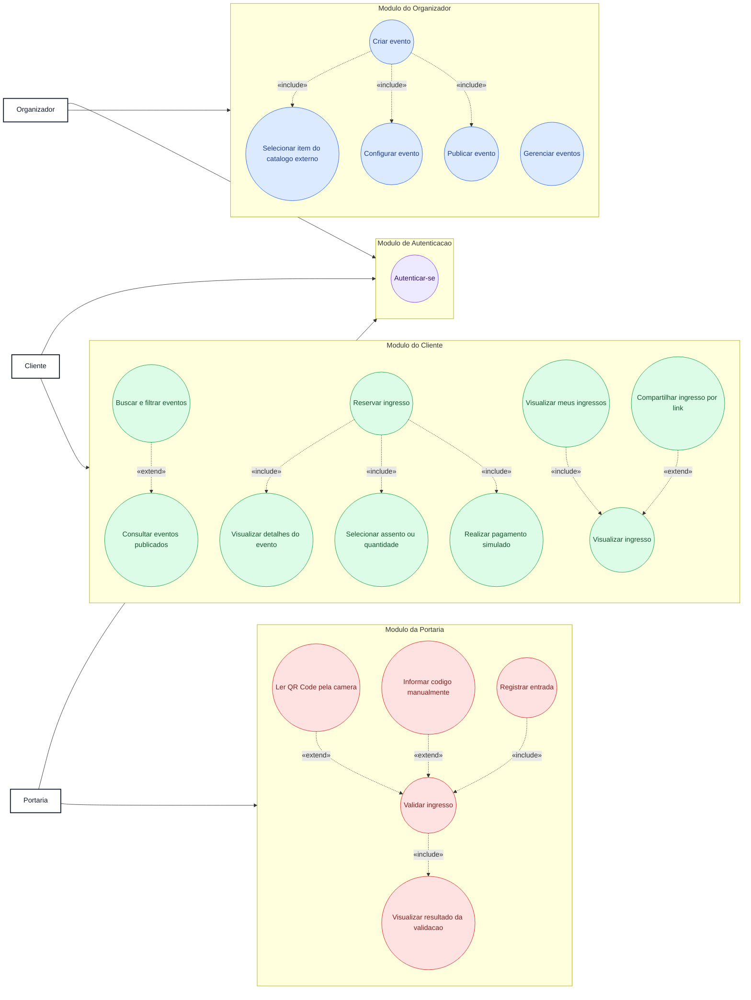

# Teste Verzel - Diagrama de Casos de Uso - Versao 1

Este diagrama representa os casos de uso iniciais da Plataforma de Eventos e Ingressos, separados por modulo e por ator.

```mermaid
flowchart LR
  Organizador[Organizador]
  Cliente[Cliente]
  Portaria[Portaria]

  Organizador --> AuthArea
  Cliente --> AuthArea
  Portaria --> AuthArea

  Organizador --> OrgArea
  Cliente --> ClienteArea
  Portaria --> PortariaArea

  subgraph AuthArea["Modulo de Autenticacao"]
    direction TB
    UC1((Autenticar-se))
  end

  subgraph OrgArea["Modulo do Organizador"]
    direction TB
    UC2((Criar evento))
    UC3((Selecionar item do catalogo externo))
    UC4((Configurar evento))
    UC5((Publicar evento))
    UC6((Gerenciar eventos))

    UC2 -.->|"«include»"| UC3
    UC2 -.->|"«include»"| UC4
    UC2 -.->|"«include»"| UC5
  end

  subgraph ClienteArea["Modulo do Cliente"]
    direction TB
    UC7((Consultar eventos publicados))
    UC8((Buscar e filtrar eventos))
    UC9((Visualizar detalhes do evento))
    UC10((Reservar ingresso))
    UC11((Selecionar assento ou quantidade))
    UC12((Realizar pagamento simulado))
    UC13((Visualizar meus ingressos))
    UC14((Visualizar ingresso))
    UC15((Compartilhar ingresso por link))

    UC8 -.->|"«extend»"| UC7

    UC10 -.->|"«include»"| UC9
    UC10 -.->|"«include»"| UC11
    UC10 -.->|"«include»"| UC12

    UC13 -.->|"«include»"| UC14
    UC15 -.->|"«extend»"| UC14
  end

  subgraph PortariaArea["Modulo da Portaria"]
    direction TB
    UC16((Validar ingresso))
    UC17((Ler QR Code pela camera))
    UC18((Informar codigo manualmente))
    UC19((Visualizar resultado da validacao))
    UC20((Registrar entrada))

    UC17 -.->|"«extend»"| UC16
    UC18 -.->|"«extend»"| UC16
    UC16 -.->|"«include»"| UC19
    UC20 -.->|"«include»"| UC16
  end

  classDef actor fill:#ffffff,stroke:#111827,stroke-width:2px,color:#111827
  classDef auth fill:#ede9fe,stroke:#7c3aed,stroke-width:1px,color:#2e1065
  classDef org fill:#dbeafe,stroke:#2563eb,stroke-width:1px,color:#1e3a8a
  classDef client fill:#dcfce7,stroke:#16a34a,stroke-width:1px,color:#14532d
  classDef gate fill:#fee2e2,stroke:#dc2626,stroke-width:1px,color:#7f1d1d

  class Organizador,Cliente,Portaria actor
  class UC1 auth
  class UC2,UC3,UC4,UC5,UC6 org
  class UC7,UC8,UC9,UC10,UC11,UC12,UC13,UC14,UC15 client
  class UC16,UC17,UC18,UC19,UC20 gate
```
